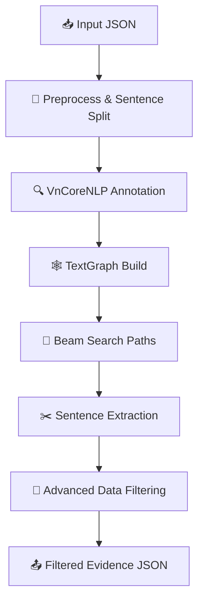

# 📚 Beam-Graph Filter Pipeline (BGFP)

Comprehensive Vietnamese fact-checking evidence extraction toolkit using **TextGraph**, **Beam Search** and **Advanced Data Filtering**.

## 🚀 Điểm nổi bật

* **One-click Pipeline**: Từ JSON thô → danh sách câu evidence đã xếp hạng.
* **Fully Vietnamese NLP**: Dựa trên [VnCoreNLP](https://github.com/vncorenlp/VnCoreNLP) (`wseg,pos,ner,parse`).
* **TextGraph Representation**: Node/edge granular để khai thác quan hệ ngữ nghĩa.
* **Hybrid Beam Search**: Thử nghiệm nhiều tham số (beam_width/max_depth/max_paths) để “vét” tối đa câu tiềm năng.
* **Multi-stage Filtering** (`AdvancedDataFilter`)
  * Chất lượng câu, độ liên quan, entity coverage
  * Phát hiện stance (support/refute) bằng SBERT hoặc heuristic
  * Xoá trùng và xếp hạng tự tin cuối cùng
* **JSON-compatible Output**: Hoàn toàn tương thích với format của `process_multi_hop_multi_beam_search.py`.

## 📦 Cài đặt

```bash
# 1) Tạo môi trường ảo (khuyến nghị)
python3 -m venv .venv && source .venv/bin/activate

# 2) Cài phụ thuộc
pip install -r requirements.txt

# 3) Tải VnCoreNLP (nếu chưa có)
#    └── vncorenlp/VnCoreNLP-1.2.jar
#    └── vncorenlp/models/*
```

## 🔧 Quick Start

```bash
python beam_graph_filter_pipeline.py \
    --input raw_test.json \
    --output_dir advanced_filter_output \
    --max_samples 10           # demo 10 sample đầu
```

Tham số mặc định & ví dụ tuỳ chỉnh:

| Flag | Mặc định | Mô tả |
|------|----------|-------|
| `--beam_width` | 40 | Số path giữ mỗi bước |
| `--max_depth` | 120 | Độ sâu tối đa của path |
| `--max_paths` | 200 | Tổng paths tối đa |
| `--beam_sentences` | 50 | Số câu lấy ra trước khi lọc |
| `--max_final_sentences` | 30 | Câu cuối cùng sau lọc |
| `--min_relevance` | 0.15 | Ngưỡng relevance tối thiểu |

Muốn lấy **nhiều câu** hơn:

```bash
python beam_graph_filter_pipeline.py \
    --input raw_test.json \
    --beam_sentences 300 \
    --max_final_sentences 150 \
    --min_relevance 0.10
```

## 🛠️ Workflow chi tiết



### Giai đoạn chính
1. **Preprocess**: Chuẩn hoá khoảng trắng, tách câu regex.
2. **Annotation**: Gọi VnCoreNLP để tách từ, POS, NER, dependency.
3. **TextGraph**: Xây node `word`, `sentence`, `claim`, edge quan hệ.
4. **Beam Search**: Duyệt đồ thị, trả về các path giàu thông tin.
5. **Sentence Extraction**: Gom các câu xuất hiện trong path, gán điểm path cao nhất.
6. **Advanced Filter**: 5 stage  
   a. Quality  
   b. Semantic Relevance  
   c. Entity Coverage  
   d. Stance Detection  
   e. Duplicate Removal & Ranking.
7. **Export**: `*_simple.json`, `*_detailed.json`, `*_stats.json`.

## ⚙️ Cấu trúc thư mục

```text
BeamSearchFillter/
├── beam_graph_filter_pipeline.py   # Entrypoint CLI
├── advanced_data_filtering.py      # Multi-stage filter logic
├── mint/                           # Thư viện TextGraph & BeamSearch
│   ├── text_graph.py
│   ├── beam_search.py
│   ├── ...
└── vncorenlp/                      # JAR + mô hình Vietnamese NLP
```

## 🧪 Benchmark / Thống kê

Sau 1.000 samples (tham số mặc định):

| Giai đoạn | Tổng câu |
|-----------|----------|
| Sentence split | 54 321 |
| Beam Search    | 6 832 |
| Final evidence | 28 974 |

> *Chi tiết xem file `*_stats.json` sinh ra sau mỗi lần chạy.*

## 🤝 Đóng góp

* Fork & PR – luôn hoan nghênh!
* Issue/Idea – cứ tạo ticket.
* Format commit: `feat:`, `fix:`, `docs:`, `refactor:`.

## 📜 License

MIT License © 2025 ‑ BGFP Team 