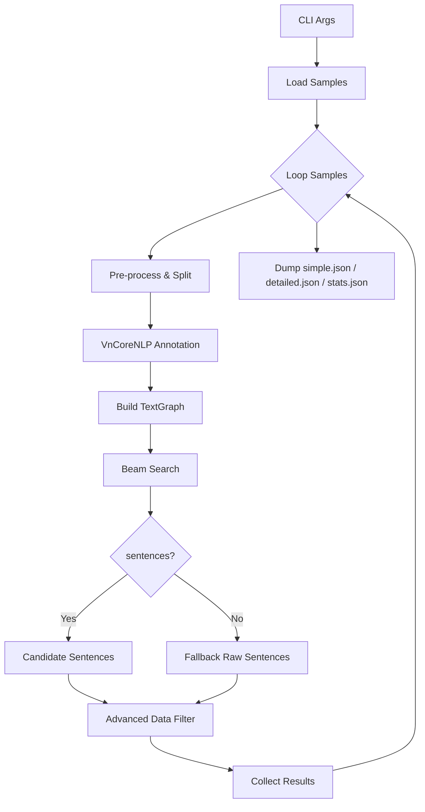

# 🏗️ Beam Graph Filter Pipeline – Detailed Workflow

Tài liệu này mô tả **toàn bộ luồng xử lý** của script `beam_graph_filter_pipeline.py`, từ khi nhập lệnh CLI đến khi sinh ra 3 file kết quả.

---

## 1. Chuẩn bị & Tham số CLI

```bash
python beam_graph_filter_pipeline.py \
    --input raw_test.json \
    --output_dir beam_filter_output \
    --beam_width 80 \
    --max_depth 300 \
    --max_paths 500 \
    --beam_sentences 400 \
    --min_relevance 0.15 \
    --max_final_sentences 30
```

| Flag | Mặc định | Ý nghĩa |
|------|----------|---------|
| `--input` | `raw_test.json` | File JSON đầu vào (list sample) |
| `--output_dir` | `beam_filter_output` | Thư mục ghi kết quả |
| `--beam_width` | 40 | Số path giữ lại mỗi bước trong beam search |
| `--max_depth` | 120 | Độ sâu tối đa của một path |
| `--max_paths` | 200 | Tổng số path tốt nhất trả về |
| `--beam_sentences` | 50 | Số câu lấy ra từ beam search trước khi lọc |
| `--min_relevance` | 0.15 | Ngưỡng điểm liên quan giữ câu ở Stage 1 |
| `--max_final_sentences` | 30 | Số câu cuối cùng sau Advanced Filter |

---

## 2. Luồng Xử Lý Tổng Quát



---

## 3. Chi tiết từng giai đoạn

### 3.1 Pre-process
* Chuẩn hoá Unicode, dấu câu, khoảng trắng (`clean_text`).
* Tách câu regex (`split_sentences`).

### 3.2 Annotation (VnCoreNLP)
* Tokenize, POS, NER, Dependency cho **context** và **claim**.

### 3.3 Xây TextGraph
* Node: `word`, `sentence`, `claim`.
* Edge: structural (word ↔ sentence/claim), dependency (word ↔ word), entity.

### 3.4 Beam Search
* Tìm path từ **claim node** đến **sentence nodes**.
* Giữ `beam_width` path/khoảng; dừng ở `max_depth`.
* Trả về tối đa `max_paths` path tốt nhất (scoring nội bộ).
* `extract_sentences_from_paths` lấy `beam_sentences` câu cao điểm nhất để tiếp tục.

### 3.4.1 Cơ chế bên trong Beam Search
**Thuật toán:**
1. Bắt đầu từ **claim node**.
2. Mở rộng tất cả neighbor (word / entity / sentence) → tạo **path ứng viên**.
3. Tính `score_path(path)` – kết hợp:
   * *Keyword overlap* giữa words trong path & claim (0-1).
   * *Fuzzy similarity* claim ↔ sentence cuối path (0-1).
   * *Path length penalty* (thưởng đường ngắn).
   * *Entity bonus* (nếu path đi qua entity node).
4. Giữ **`beam_width`** path điểm cao nhất.
5. Lặp tới `max_depth` bước hoặc khi đủ **`max_paths`**.
6. Trả về danh sách path, đã sort giảm dần theo `score`.

> Thực thi bởi lớp `BeamSearchPathFinder` (mint/beam_search.py). Hàm chính:
> * `find_best_paths()` ⟶ trả về top-N path.

### 3.5 Fallback (không có path)
Nếu Beam Search ra 0 câu → dùng toàn bộ câu gốc (đã tách) làm candidate.

### 3.6 Advanced Data Filter (ADF)
| Stage | Mô tả | Bật/Tắt |
|-------|-------|---------|
| 1 | **Semantic Relevance Filtering** – keyword overlap, topic coherence, SBERT (nếu có) | luôn |
| 2 | **Entity-Based Filtering** – giữ câu chứa entity liên quan | khi truyền `entities` |
| 3 | **Contradiction / Stance Detection** – SBERT hoặc NLI | khi `use_contradiction_detection` |
| 4 | **Duplicate Removal & Ranking** – xoá câu trùng, tính `confidence_score`, cắt còn `max_final_sentences` | luôn |

> Với cấu hình default (không SBERT, không NLI, không entity) chỉ Stage 1 và 4 hoạt động.

### 3.6.1 Phân rã công thức & logic AdvancedDataFilter
| Stage | Tên hàm | Điểm chính |
|-------|---------|------------|
| 1 | `_stage2_semantic_relevance_filtering` | *relevance_score* = 0.6×keyword_overlap + 0.4×topic_coherence (hoặc 0.4/0.4/0.2 khi có SBERT). Giữ câu `≥ min_relevance_score`. |
| 2 | `_stage3_entity_based_filtering` | *entity_score* = 0.6×frequency + 0.4×relevance_to_claim. Bỏ nếu không truyền `entities`. |
| 3 | `_stage4_contradiction_detection` | So cosine(SBERT) giữa câu và claim (vs. negated-claim) → phân loại `support/refute`; loại *neutral*. |
| 4 | `_stage5_duplicate_removal_and_ranking` | *confidence_score* = 0.2 quality + 0.3 relevance + 0.2 entity + 0.2 (1-contradiction) + 0.1 original_beam_score. Sort & cắt `max_final_sentences`. |

**Quality score** (dùng ở Stage 4):
* Độ dài tối ưu (5-50 từ).
* *Information density* (từ meaningful / tổng từ).
* *Sentence structure* (có Subject-Verb, v.v.).
* *Content richness* (đa dạng từ/ngữ).  
`quality_score = 0.3 length + 0.3 density + 0.2 structure + 0.2 richness`.

> File nguồn: `advanced_data_filtering.py`. Bạn có thể chỉnh *weights* tuỳ nhu cầu.

### 3.6.2 Lọc **leftover_sentences** (ngoài Beam)
Từ v1.1, script sẽ:
1. So sánh danh sách câu gốc (`raw_sentences`) với `candidate_sentences`.
2. Những câu **không xuất hiện** trong candidate → `leftover_sentences`.
3. Chạy `AdvancedDataFilter` **một lần nữa** cho nhóm này.
4. Gộp kết quả `extra` vào `final_sentences`, tránh trùng lặp.

→ Đầu ra cuối cùng = câu qua Beam + câu ngoài Beam nhưng đủ điểm relevance.

---

### 3.7 Collect & Append
* Tạo `simple_result` (context, claim, evidence list).
* Tạo `detailed_result` (thêm điểm số + thống kê beam).
* Append vào `simple_outputs`, `detailed_outputs`.

### 3.8 Xuất file
* Sau khi xử lý xong tất cả sample:
  * `_simple.json` mảng `simple_result`.
  * `_detailed.json` mảng `detailed_result`.
  * `_stats.json`  thống kê tổng (số câu, thông số beam).

---

## 4. Tips tối ưu

| Mục tiêu | Gợi ý |
|----------|-------|
| Tăng độ phủ câu (>90 %) | Tăng `beam_sentences`, `beam_width`, `max_paths`. Đặt `beam_sentences=-1` để không giới hạn. |
| Giảm thời gian chạy | Giảm `max_depth`, giảm `beam_width`, bỏ SBERT/NLI. |
| Ghi kết quả từng sample ngay | Sử dụng định dạng **JSON Lines** (`.jsonl`) và mở file với mode `"a"`. |
| Tắt/ bật SBERT | `use_sbert=True` khi khởi tạo `AdvancedDataFilter` (đảm bảo `sentence-transformers`). |

---

## 5. Chuyển đổi JSON Lines → Array
Nếu dùng chế độ `jsonl` và muốn gộp thành mảng:
```bash
jq -s '.' raw_test_beam_filtered_0.15_*.jsonl > merged_simple.json
```

---

## 6. Liên hệ & Đóng góp
* Issue / PR luôn hoan nghênh!
* Tuân thủ quy tắc commit: `feat:`, `fix:`, `docs:`, `refactor:`.

MIT License © 2025 – BGFP Team 

## 7. Chạy thử nhanh
```bash
python beam_graph_filter_pipeline.py \
  --input raw_test.json \
  --output_dir demo_output \
  --beam_width 80 \        # theo config benchmark
  --max_depth 300 \        # path dài hơn, phủ rộng hơn
  --max_paths 500 \        # đủ nhiều path
  --beam_sentences 400 \   # lấy 400 câu trước khi lọc
  --max_final_sentences 50 \
  --min_relevance 0.15 \
  --max_samples 5          # demo 5 sample đầu
```
Sau khi chạy, bạn sẽ thấy:
* `demo_output/*_simple.json` – danh sách evidence (đã gộp leftover).
* `demo_output/*_detailed.json` – điểm số & metadata.
* `demo_output/*_stats.json` – thống kê tổng.
